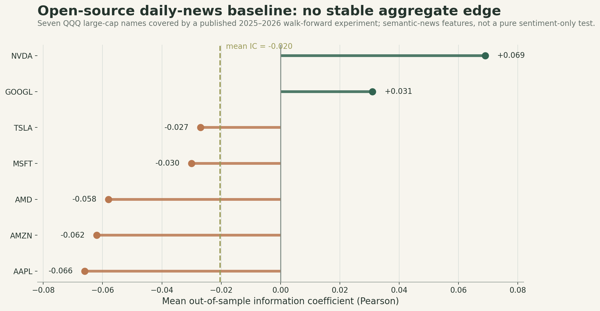
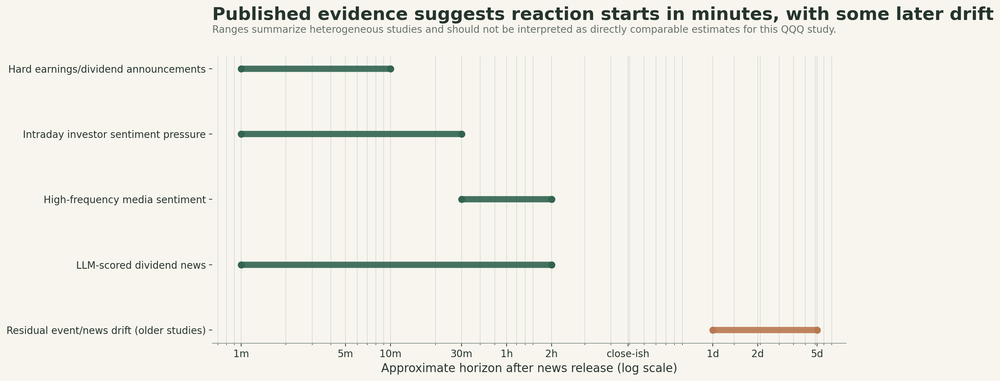
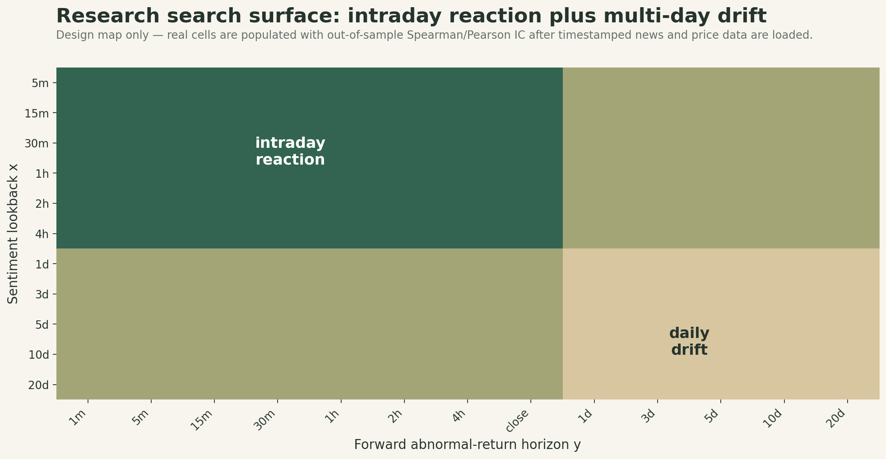

# QQQ News Sentiment → Price Reaction Study

A reproducible research pipeline for answering two questions:

1. **Which news-sentiment lookback `x` has the strongest relationship with forward abnormal return over horizon `y`?**
2. **How quickly does the market incorporate the sentiment signal?**

The project correlates sentiment with **future abnormal returns**, not stock-price levels. It uses chronological validation, a purged untouched test period, block-bootstrap confidence intervals, HAC statistics, and Benjamini-Hochberg FDR correction so the result is not simply the largest correlation found in a large `(x, y)` search.

## Research evidence

The repository is designed for institutional timestamped news + intraday price data. Until those feeds are loaded, the figures below separate **verified public evidence** from the experiment design. They are not presented as a completed QQQ trading backtest.

### Public walk-forward baseline

An independently published open-source 2025–2026 walk-forward experiment covers seven QQQ large-cap names that overlap this research universe. Its features are semantic-news features rather than pure sentiment, so this is a useful baseline rather than the final test.

| Ticker | Mean OOS IC | Mean rank IC | Sessions |
|---|---:|---:|---:|
| NVDA | +0.069 | +0.058 | 281 |
| GOOGL | +0.031 | +0.093 | 279 |
| TSLA | -0.027 | -0.006 | 280 |
| MSFT | -0.030 | +0.074 | 280 |
| AMD | -0.058 | -0.088 | 251 |
| AMZN | -0.062 | -0.056 | 281 |
| AAPL | -0.066 | -0.078 | 280 |
| **Mean** | **-0.020** | **~0.000** | — |

<p align="center">
  
</p>

The aggregate result is close to zero/negative, which is consistent with the hypothesis that **daily close-to-close analysis may be too slow** to capture much of the information response.

### How fast can markets react to news?

Published event and sentiment studies suggest that the first meaningful price adjustment can occur within **minutes**, while some event classes show residual drift over hours or days. These studies use different samples and methods, so the ranges below are directional evidence rather than pooled estimates.

<p align="center">
  
</p>

This motivates an intraday-first experiment with explicit reaction-speed measures such as `T50` and `T80`.

## Exact research surface

The main analysis searches sentiment lookback `x` against future abnormal-return horizon `y` rather than selecting one lag in advance.

<p align="center">
  
</p>

The intended grid covers:

- sentiment lookbacks from **5 minutes to 20 trading days**
- forward-return horizons from **1 minute to 20 trading days**
- intraday price reaction and multi-day post-news drift in one framework

A useful result should appear as a **stable region**, not one isolated high-correlation cell.

## Core definitions

For article `j` affecting stock `i`:

```text
article_score = sentiment × relevance × novelty × source_quality
```

At time `t`, sentiment over lookback `x` is an exponentially decayed weighted average using only news that was already public by `t`.

The default outcome is market-adjusted forward log return:

```text
abnormal_return(i,t,y)
    = stock_log_return(i,t→t+y)
    - QQQ_log_return(t→t+y)
```

Set `returns.abnormal_method: beta_adjusted` in the YAML configuration to use a rolling pre-event beta instead.

Reaction speed is measured from the cumulative abnormal-return spread between the highest and lowest sentiment quintiles:

```text
SpreadCAR(h)
    = mean(CAR | top sentiment quintile)
    - mean(CAR | bottom sentiment quintile)
```

`T50` and `T80` are the earliest horizons that reach 50% and 80% of the pre-specified terminal response.

## What the pipeline produces

- `grid_metrics_by_fold.csv` — validation stability metrics for every lookback × horizon × chronological fold
- `grid_metrics_validation.csv` — validation-fold IC and stability statistics
- `grid_metrics_test.csv` — untouched final-fold grid with bootstrap CI, HAC, and FDR inference
- `ic_heatmap_validation.png` and `ic_heatmap_test.png` — sentiment lookback × forward-return heatmaps
- `reaction_curve_test.csv` — final-fold Q5 minus Q1 cumulative abnormal-return response
- `reaction_speed_metrics_test.csv` — final-fold `T50` and `T80`
- `reaction_curve_test.png` — final-fold market-reaction-speed curve
- `predictive_panel.csv` and `event_reaction_panel.csv` — inspectable research panels

Plots use a restrained earth/forest palette.

## Install

```bash
python -m venv .venv
source .venv/bin/activate
pip install -e ".[dev]"
```

On Windows PowerShell:

```powershell
.venv\Scripts\Activate.ps1
pip install -e ".[dev]"
```

## Run the synthetic end-to-end demo

The synthetic demo is a **pipeline validation only**. It deliberately injects a decaying sentiment response into synthetic intraday prices so the analysis path can be tested end to end.

```bash
qqq-sentiment demo --output-dir outputs/demo
```

Then inspect:

```text
outputs/demo/ic_heatmap_validation.png
outputs/demo/ic_heatmap_test.png
outputs/demo/reaction_curve_test.png
outputs/demo/summary.csv
```

Do not interpret the demo correlations as empirical market results.

## Run on real data

Normalize feeds to the schemas in [`docs/data_contract.md`](docs/data_contract.md), then run:

```bash
qqq-sentiment run \
  --news /path/to/news.parquet \
  --prices /path/to/intraday_prices.parquet \
  --config config.example.yaml \
  --output-dir outputs/real
```

CSV is supported with the base install. Parquet is supported with:

```bash
pip install -e ".[parquet]"
```

`config.example.yaml` contains the full 5-minute-to-20-day lookback and 1-minute-to-20-day forward-horizon grid. The built-in no-config defaults are shorter so the synthetic demo runs quickly.

## Recommended production data

For the definitive intraday study, use a timestamped institutional news feed with entity mapping, relevance, novelty, and story versioning plus institutional intraday trades/quotes.

A strong setup is:

- **LSEG Machine Readable News / News Analytics + LSEG Tick History**
- **RavenPack News Analytics + institutional tick data** as a strong alternative
- **CRSP** for long-history daily robustness

This repository does not embed paid-provider credentials or assume proprietary vendor column names. Vendor exports map into a small normalized input contract instead.

## Important methodology choices

- News is never allowed into a signal before `first_timestamp_utc`.
- Predictive tests start from the **first stock bar strictly after publication**.
- Reaction-speed tests use the **last stock price known at or before publication** so the immediate response is retained.
- Repeated syndicated stories are deduplicated by `story_id × ticker`.
- GOOG/GOOGL should share an `issuer_id` and should not be treated as two independent issuer observations in a cross-sectional robustness study.
- Minute/finer data is used for market-reaction speed; daily close-to-close data is too coarse for that question.
- Whole market-calendar dates are assigned to chronological folds using `market_timezone`.
- The last fold is held out as a final test.
- Validation observations whose maximum forward horizon would cross the test boundary are purged.
- `(x, y)` selection uses earlier folds and stability, not raw `argmax(correlation)` alone.
- A historical production backtest should use **point-in-time QQQ constituents** to avoid survivorship bias.

For publication-quality inference, increase `validation.bootstrap_samples` in the YAML to roughly `1000–5000`. The example defaults to 500 to keep exploratory runs practical.

## Tests

```bash
pytest -q
```

## Repository layout

```text
src/qqq_sentiment/
  analysis.py   # predictive grid + event reaction study
  returns.py    # event/bar alignment and abnormal returns
  signals.py    # lagged decayed sentiment
  stats.py      # bootstrap, HAC, FDR, chronological folds
  plots.py      # heatmap and reaction-speed visualizations
  synthetic.py  # deterministic end-to-end demo
  cli.py        # command-line entry point

tests/
docs/
  data_contract.md
  results/
    latest/
      public_baseline_ic.png
      reaction_speed_evidence.png
      research_search_grid.png
      public_baseline_ic.csv
      reaction_speed_evidence.csv
config.example.yaml
```

## Showing plots in this README

GitHub renders the figures above directly from relative repository paths. Keep the files at:

```text
docs/results/latest/
```

and reference them in Markdown/HTML like this:

```html
<p align="center">
  
</p>
```

This is preferable to linking an external image host because the README and its figures remain versioned together.

## Research interpretation

A useful result is not one isolated bright heatmap cell. Look for a **stable region** that keeps the same sign across chronological folds, has adequate coverage, survives FDR/uncertainty checks, and remains present in genuinely unseen periods.

Correlation is predictive association, not proof that news sentiment caused the price move.
